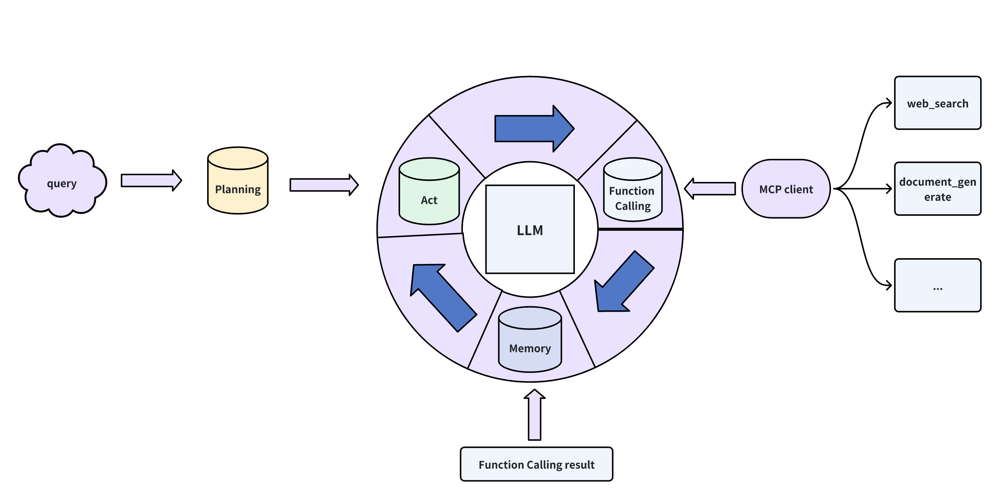

# Simple AI Agent

## Architecture


## Features
This AI agent can perform task decomposition, step-by-step problem solving, web search, and file generation functionalities.

The web search and file generation features are powered by **MCP (Model Context Protocol)** technology.

As a user (or "boss"), you can give the AI agent a task. The agent will automatically decompose the task into multiple steps and execute them one by one. If a step involves a task beyond the language model's capabilities, the model will send a request to the MCP server through the MCP client. The server will choose the appropriate tool and return the result.

Currently, the completed features include: web search, markdown file generation, and file upload. Future updates will include terminal control, code writing and execution, browser control, and more.

## Quick Start
1. Clone the project.
    ```bash
    git clone https://github.com/Succoney/Simple-AI-Agent.git
    cd Simple-AI-Agent/
    ```

2. Create the environment.
    ```bash
    conda create -n simple-agent python=3.12
    conda activate simple-agent
    ```

3. Install dependencies.
    ```bash
    pip install -r requirements.txt

    # If installation fails, use the following:
    python -m pip install -r requirements.txt
    ```

4. Configure the large model and web search API parameters.
   Input the relevant parameters such as model name, API URL, and API key in the `./config/config.env` file.

5. Start the AI agent.
    ```bash
    cd agent/
    sh run_agent.sh
    ```

## Demo
[](https://www.bilibili.com/video/BV1d5dJY8E4n?t=10.3)

### Execution Logic of the AI Agent:
1. The user inputs a question.
2. The large model analyzes the question and breaks it down into different task categories: web search, context summarization, dialogue, document generation.
3. For web search tasks, the model decomposes the task into search queries that the browser can directly use. Other tasks are not further decomposed.
4. Once each task is completed, the results are stored in the messages for memory.
5. When all tasks are completed, the question posed by the user is considered solved.

## Drawbacks and Future Plans

### Drawbacks
1. As an AI Agent, it can only solve problems through web searches and markdown file generation, which is insufficient.
2. The search keywords are too straightforward, leading to potential search failures. This not only wastes time but also disrespects financial resources. This issue will be addressed in future updates.
3. Although the AI agent outputs the results of each step, displaying them in the terminal is not ideal. A frontend visualization will be developed when possible.
4. Initially, the plan was to check if each step's result fully solved the task at hand. However, this feature has not been implemented yet due to time constraints.

### Future Plans
1. Expand the MCP server with browser control, terminal control, code generation and execution, and UI control.
2. Optimize search keywords.
3. Implement checks for each step's result and integrate reflections into the framework.
4. Develop a frontend interface.
